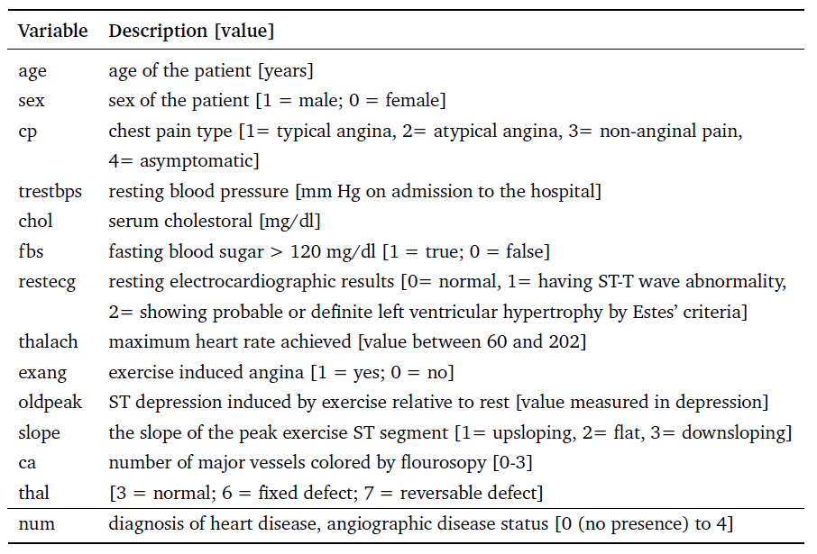

# Multivariate-Analysis_lab
**Heart Disease Prediction** 
The goal of this project is detecting patients with risk of cardiovascular diseases (CVD) based on their physiological risk
factors such as cholesterol, hypertension, diabetes, etc., an early diagnosis of the patient could
be made. 
This project has been devided to below parts: 
-section1: Data Curtain 
-section2:  
## Subsection 1: Data Curtain
The [dataset](https://www.kaggle.com/datasets/redwankarimsony/heart-disease-data) has been chosen from UCI Machine Learning Repository and consisted of 4 different datasets which belong to patinets from different hospitals. In below the name of hospitals and number of patients in each of them have been provided: 
- Cleveland Clinic Foundation (303 observations)
- Hungarian Institute of Cardiology, Budapest (294 observations)
- V.A. Medical Center, Long Beach, CA (200 observations)
- University Hospital, Zurich, Switzerland (123 observations) 
The features that are common in all these datasets are provided in below table and in general 14 features have been considerd. 

 

### Sub-subsection 1.1: Deal with missing data
In the dataset description, missing data  it inidicates that missing values are identified with−9, we replace
those values with NA, so that we identify them as missing.

